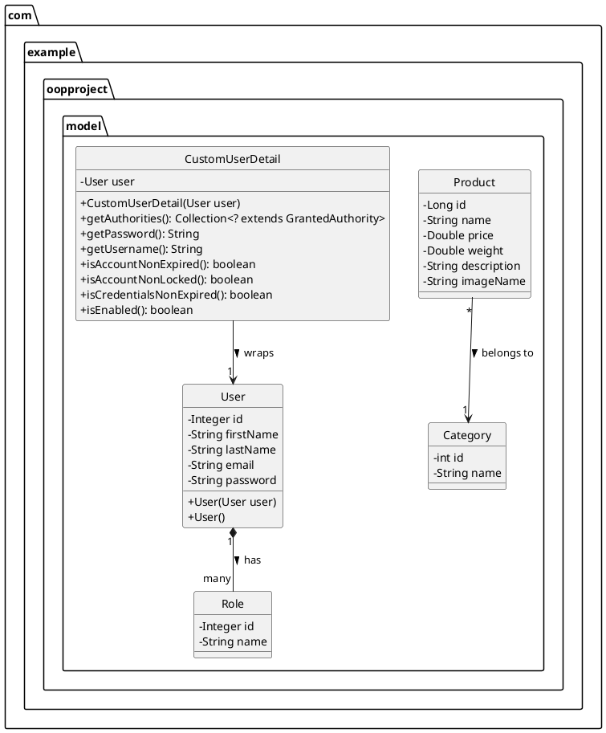
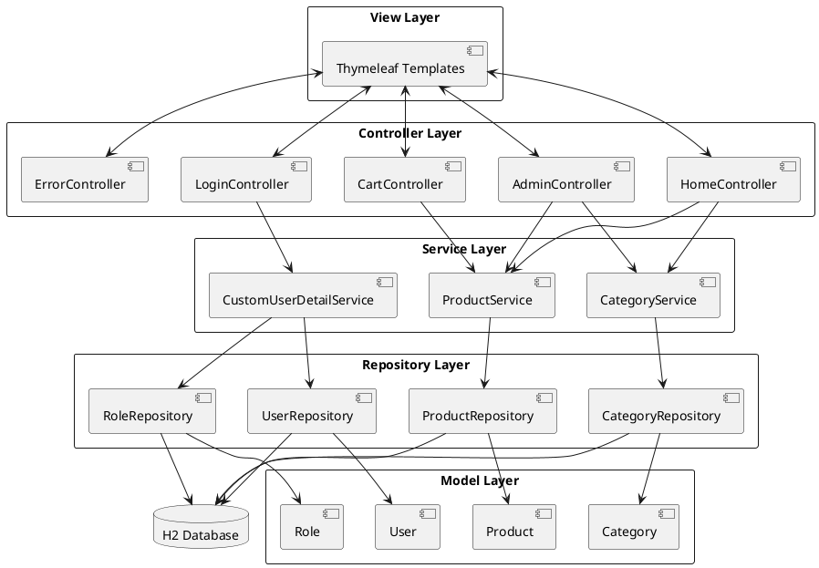
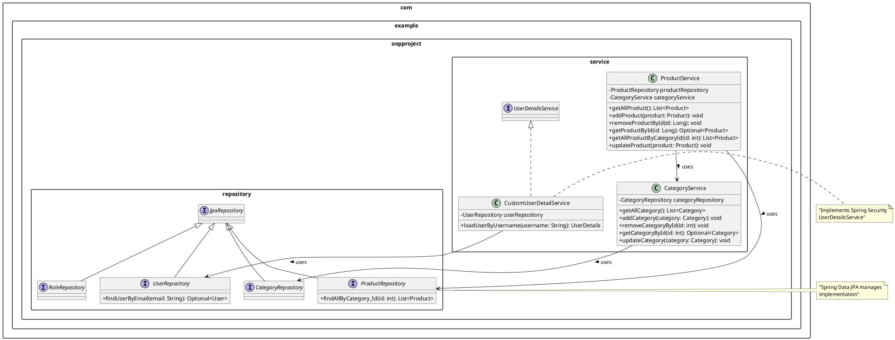
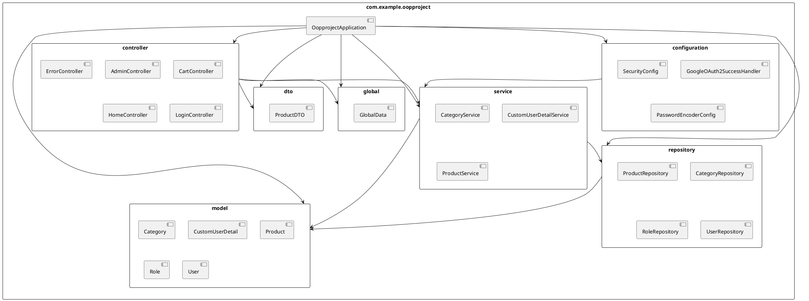
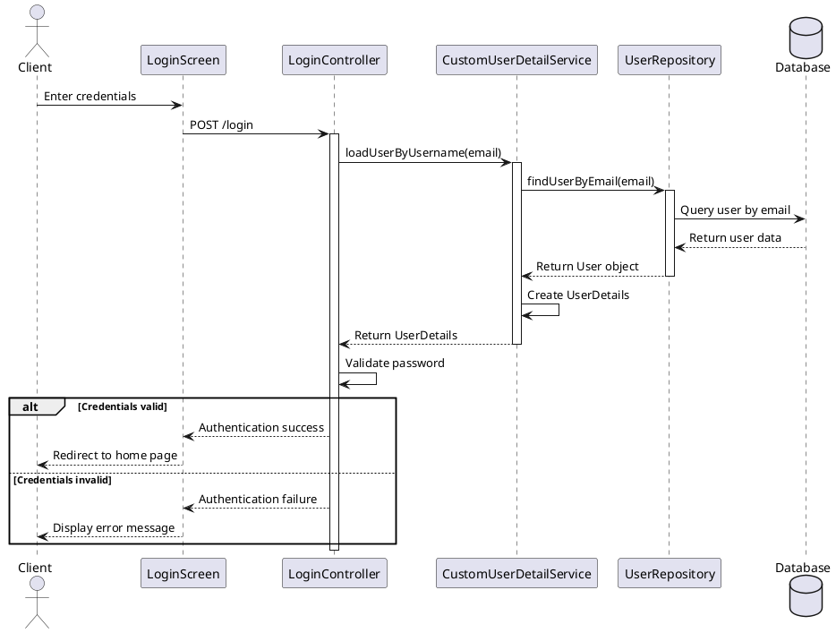
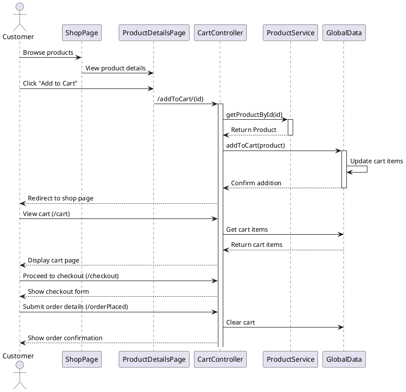
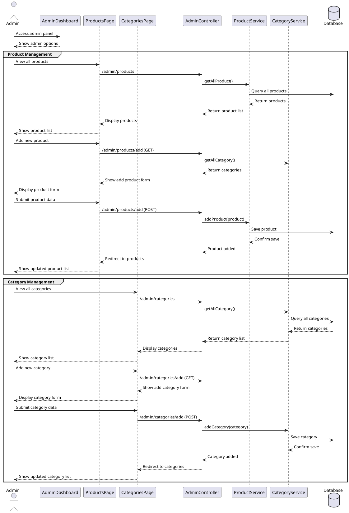
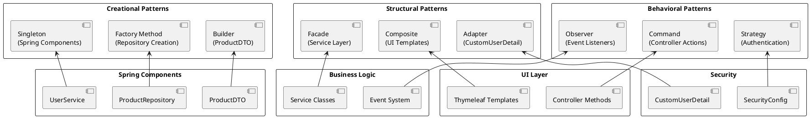
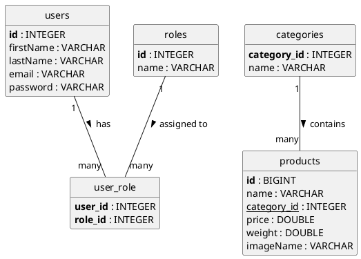
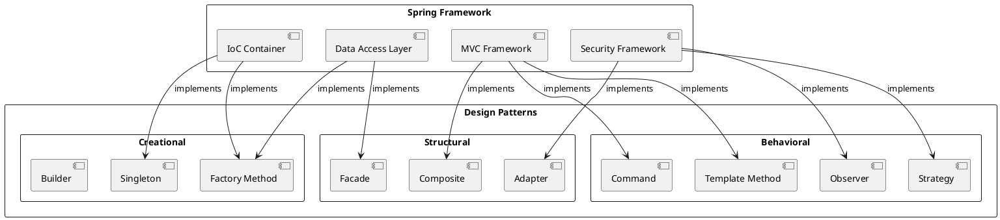

# UML Diagrams for OOP_PROJECT E-Commerce System

This document contains various UML diagrams to illustrate the architecture, classes, and interactions in the OOP_PROJECT e-commerce system.

## Table of Contents
- [Domain Model Class Diagram](#domain-model-class-diagram)
- [MVC Architecture Diagram](#mvc-architecture-diagram)
- [Service and Repository Layer](#service-and-repository-layer)
- [Package Structure](#package-structure)
- [Authentication Flow](#authentication-flow)
- [Shopping Cart Flow](#shopping-cart-flow)
- [Admin Management Flow](#admin-management-flow)

## Domain Model Class Diagram



## MVC Architecture Diagram



## Service and Repository Layer



## Package Structure



## Authentication Flow



## Shopping Cart Flow



## Admin Management Flow



## Design Patterns Implementation



## Complete System Architecture

```plantuml
@startuml "System Architecture"
!include <archimate/archimate>
!include <archimate/Archimate>

title E-Commerce System - Architecture Overview

' Define the layers
Business_Layer(business, "Business Layer") {
    Business_Service(user_management, "User Management")
    Business_Service(product_catalog, "Product Catalog")
    Business_Service(shopping_cart, "Shopping Cart")
    Business_Service(checkout, "Checkout Process")
    Business_Service(admin_panel, "Admin Panel")
}

Application_Layer(application, "Application Layer") {
    Application_Component(controllers, "Controllers")
    Application_Component(services, "Services")
    Application_Component(repositories, "Repositories")
    Application_Component(security, "Security")
    Application_Component(global_data, "Global Data")
}

Technology_Layer(technology, "Technology Layer") {
    Technology_Service(spring_boot, "Spring Boot")
    Technology_Service(thymeleaf, "Thymeleaf")
    Technology_Service(h2_database, "H2 Database")
    Technology_Service(spring_security, "Spring Security")
}

' Relationships between layers
Rel_Flow_Up(technology, application, "Supports")
Rel_Flow_Up(application, business, "Realizes")

' Internal relationships in Business Layer
Rel_Flow(product_catalog, shopping_cart, "Products added to")
Rel_Flow(shopping_cart, checkout, "Proceeds to")
Rel_Flow(user_management, shopping_cart, "Associates with")
Rel_Flow(user_management, checkout, "Provides details for")
Rel_Flow(admin_panel, product_catalog, "Manages")

' Internal relationships in Application Layer
Rel_Flow(controllers, services, "Uses")
Rel_Flow(services, repositories, "Uses")
Rel_Flow(controllers, security, "Protected by")
Rel_Flow(controllers, global_data, "Uses")

' Internal relationships in Technology Layer
Rel_Flow(spring_boot, thymeleaf, "Integrates")
Rel_Flow(spring_boot, h2_database, "Uses")
Rel_Flow(spring_boot, spring_security, "Incorporates")

@enduml
```

## Database Schema



## Design Patterns Relationships


